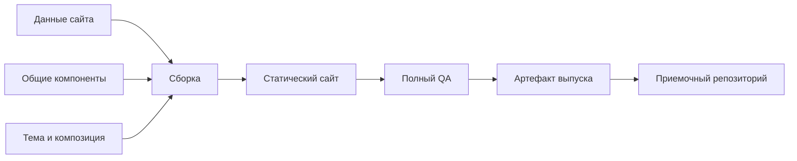

# План внедрения общей сборки сайтов AR

Дата: 2026-09-16.
Статус: предложен; реализация не начата.

## Цель и границы

Создать процесс, в котором сайты собираются из общих компонентов, тем и индивидуальных данных. Общие исправления вносятся один раз, каждый выпуск воспроизводится и проходит автоматические проверки.

Текущий репозиторий остается местом приема готовых поставок. Генератор реализуется в отдельном upstream-проекте либо развивается на основе существующего внешнего генератора после изучения его исходников.

Дублирование устраняется в исходниках. Повторение разметки и ресурсов в готовых независимых сайтах допустимо: каждый домен должен размещаться автономно.

Исторические поставки сохраняются. Переписывание истории Git, публикация, развертывание и изменение существующих сайтов не входят в сохранение этого плана.

## Основания

По анализу текущего состояния репозитория:

- 30 сайтов, по 17 страниц, всего 510 HTML-файлов.
- 30 разных CSS-файлов суммарно около 4,1 МБ и 30 разных JS-файлов со сходным поведением.
- В выборке повторяются шапки, подвалы, меню и cookie-баннеры.
- В 24 скриптах найдены некорректные значения присваивания `style.overflow`; в 25 присутствует отдельный патч `FIX:RESIZE`.
- 968 WebP-файлов, из них 955 уникальных; лишние точные копии занимают около 1,8 МБ.
- Два отслеживаемых ZIP-архива занимают около 104,8 МБ.
- Отчет второй части заявляет проверку 85 страниц, но сохраненный visual JSON содержит режим `spot` и суммарно 14 проверенных страниц.

Это результаты инвентаризации, чтения кода и сохраненных отчетов. Новый браузерный QA в рамках анализа не выполнялся. Причину некорректных значений `overflow` нужно подтвердить по исходникам генератора.

## Целевой процесс

## 1. Зафиксировать исходное состояние и границы пилота

- Выбрать три сайта: один с понятными классами, один с переименованными классами и один с существенно отличающейся компоновкой.
- Для каждого составить перечень 17 страниц, маршрутов, ресурсов, форм и интерактивных элементов.
- Зафиксировать исходный commit и выполнить существующий полный QA.
- Устранить расхождение отчета второй части с режимом `spot` новым полным прогоном и синхронизацией отчета.
- Отдельно записать уже существующие дефекты и ожидаемые исправления.

**Критерий готовности:** есть проверенная исходная версия для сравнения; известные дефекты отделены от возможных регрессий переноса.

## 2. Определить место реализации и закрепить сборку

- Изучить внешний генератор, когда его исходники будут доступны. Если он пригоден для развития, внедрять компоненты там.
- Для нового проекта использовать как базовый вариант Eleventy + Nunjucks, обычный CSS и небольшой модульный JavaScript. Окончательно закрепить стек после изучения upstream-проекта.
- Зафиксировать зависимости, lockfile и версии среды.
- Предусмотреть команды проверки данных, сборки одного сайта, выбранной партии и всех сайтов.
- Выполнять сборку в чистый выходной каталог, не поверх исторических поставок.

**Критерий готовности:** минимальный сайт воспроизводимо собирается локально и в CI.

## 3. Создать модель данных сайта

- Разделить данные на бренд и контакты, маршруты, содержимое страниц, тему, состав секций и настройки поведения.
- Задавать домен, email и телефоны в одном месте. Для телефона хранить отображаемое и машинное представление.
- Формировать sitemap, canonical и метаданные из общих данных и реестра маршрутов.
- Ввести стабильный идентификатор сайта, независимый от домена.
- Описать обязательные поля и допустимые варианты через JSON Schema.
- Установить порядок настроек: общие значения, тема, сайт, страница. Массивы секций заменять целиком, без неявного объединения.

**Критерий готовности:** некорректные данные останавливают сборку с понятным сообщением; новый сайт можно описать без копирования HTML.

## 4. Выделить общие компоненты и темы

- Первыми перенести Header, Footer, Button, ContactForm, CookieBanner и FAQ.
- Выделить шаблоны главной, каталога, отдельной программы, статьи, команды и служебных страниц.
- Разделить CSS на базовые правила, компоненты и токены тем.
- Выражать различия компоновки вариантами компонентов и порядком секций. Уникальную секцию оставлять отдельной, пока повторное использование не оправдывает обобщение.
- Использовать стабильные `data-*` атрибуты для поведения JavaScript, независимо от классов оформления.
- Исправить общий механизм блокировки прокрутки. Проверить Escape, resize, управление фокусом и состояния меню.
- Если переименование классов необходимо, выполнять его отдельным этапом с согласованным преобразованием HTML/CSS/JS. Не применять неограниченную замену строк к программным значениям.

**Критерий готовности:** исправление общего компонента применяется ко всем его потребителям через пересборку.

## 5. Перенести пилот и проверить совместимость

- Переносить сайты по одному, сохраняя маршруты, контент и самостоятельность каждого выпуска.
- Сначала добиться соответствия исходному сайту, затем отдельно оптимизировать ресурсы.
- Проверить внутренние ссылки, якоря, метаданные, изображения и фактический сценарий отправки форм.
- Сравнить внешний вид на desktop/mobile, включая открытое меню, hover, FAQ и cookie-баннер.
- Выполнить полный QA существующим инструментарием.

**Критерий готовности:** у каждого пилотного сайта доступны все 17 страниц, согласованные изменения документированы, полный QA проходит.

## 6. Автоматизировать проверку и выпуск

- Настроить CI: проверка данных, сборка, проверка структуры и ссылок, существующий QA, отчет, упаковка.
- Использовать инструментарий Cursor skill `auditing-landing-batch-pages-buttons` с закрепленной версией и окружением, включающим Playwright и Chromium.
- Не создавать сканеры внутри партий; использовать существующий `run_batch_qa.py`.
- Добавить короткие функциональные проверки общих интерактивных компонентов, дополняющие визуальный QA.
- Формировать отчет из JSON одного запуска. Учитывать фактическую схему результата выбранной версии сканера.
- Прикладывать к выпуску версии генератора и данных, перечень сайтов и контрольные суммы.
- Использовать быстрый `scan` во время работы, полный `final` перед выпуском.

Условия выпуска:

- `unique_btn_fails=0` по результатам проверки контраста.
- Visual `page_fails=[]` и полный режим проверки.
- Чистый RTL/contact overflow.
- Отчет синхронизирован с JSON текущего запуска.
- Функциональные проверки общих компонентов проходят.

**Критерий готовности:** частичная проверка или устаревший отчет не позволяют выпустить партию.

## 7. Оптимизировать хранение и повторные сборки

- Новые ZIP размещать в хранилище артефактов выпусков.
- Передавать в приемочный репозиторий согласованный комплект сайтов, отчетов и сведений о выпуске.
- Сохранять исторические поставки. Удаление архивов из текущего дерева само по себе не уменьшает историю Git.
- После стабильного пилота добавить кеширование по входным данным: изменение сайта пересобирает его, изменение общего компонента пересобирает всех потребителей.
- Учитывать в ключах кеша версии генератора, зависимостей, компонентов, тем, данных и ресурсов.
- Оптимизировать размеры изображений, шрифты с арабским набором символов и набор иконок по измерениям.

**Критерий готовности:** сокращены повторные операции и прирост Git; конкретный выпуск можно воспроизвести, а предыдущий вернуть.

## 8. Перенести остальные сайты группами

- Сгруппировать оставшиеся 27 сайтов по структуре и переносить небольшими партиями.
- После каждой партии выполнять полный QA и проверять сохранение маршрутов и поведения.
- Зафиксировать правила добавления сайта, изменения общей темы и выпуска исправления.
- Установить правило: изменения исходников выполняются в генераторе; экстренные исправления готовой поставки возвращаются в соответствующий компонент или данные до следующего выпуска.

**Критерий готовности:** новый сайт создается из данных и композиции, общие исправления вносятся один раз, выпуск воспроизводится и проходит проверки без ручного редактирования сгенерированных файлов.

## Первая контрольная точка

Три перенесенных сайта, 51 страница, общие компоненты и автоматический выпуск с полным QA.

По итогам пилота измерить:

- объем общих и индивидуальных исходников;
- время полной сборки и сборки одного сайта;
- время полного QA;
- размер готовых ресурсов;
- трудоемкость переноса одного сайта;
- число исправлений, которые удалось применить через общий компонент.

После пилота оценить сроки переноса остальных сайтов и приоритет дальнейших оптимизаций. До изучения внешнего генератора и завершения пилота точные сроки и процент сокращения кода не фиксируются.
